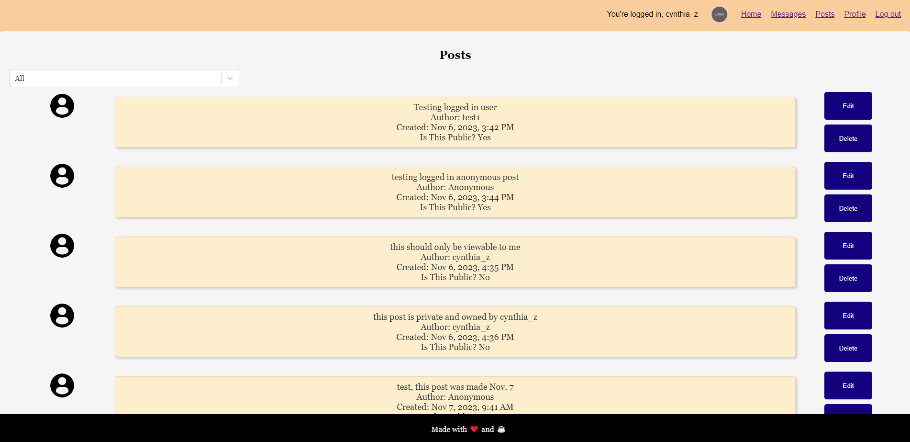
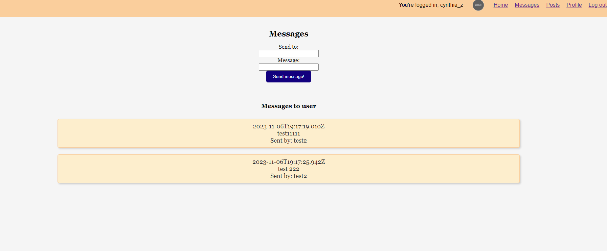
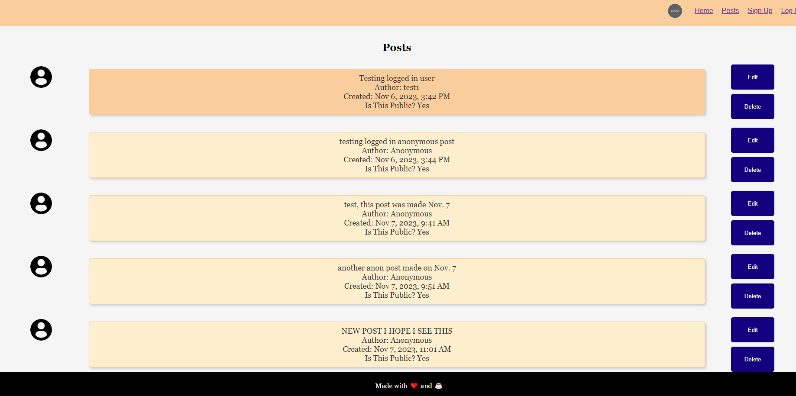

# Mod 3 Project

### Introduction
A project to practice making full CRUD websites. Website is a MVP meant to mimic the basic functionalities of a social media website. The user can log in, add/edit/delete posts, and send messages between them and another user. Project can be improved to more closely align with my first goal of creating a mental health focused social media site. 

### Technologies Used
- Front end
	- HTML/CSS
	- React
	- Imported a few third party node modules (react-select and react-modal)
- Back end
	- Express
	- Node
	- MongoDB and Mongoose as an intermediary 

### Getting Started
Either:
- Clone this github repo and run everything locally
	- "git clone https://github.com/czhu-24/perscholas-mod3-project"
	- "cd client && npm install"
	- "cd ../backend && npm install && touch .env"
	- "code .env" and fill out the values of the .env file... 
	- "cd .. && npm run servers"
	- and you *should* be good to go
- Access the app hosted on render (see link below)

### Unsolved Problems
- Cannot currently display formattedCreatedAt date for messages
- Deletion and editing of posts only refreshes on front end after page refresh

### Future Enhancements
- Build more robust validation and sanitation for all inputs
- Create more attractive, cozy, and responsive styling.
	- Could also add CSS animations for creating posts and sending messages.
- Add ability to use gifs, photos, and other types of data for posts and messages
- Tag each post with multiple tags that are then searchable
- Add just-for-features like the ability to send an animation of crabs scurrying across the screen to another user and different themes for holidays
- Add API integration for chatbot interaction

### Link to demo: https://mod-3-gg1y.onrender.com
